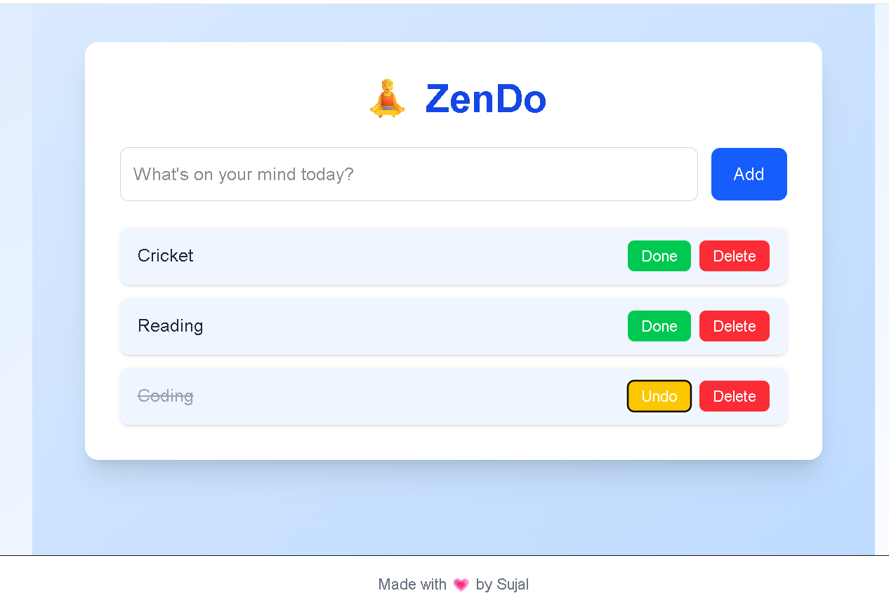
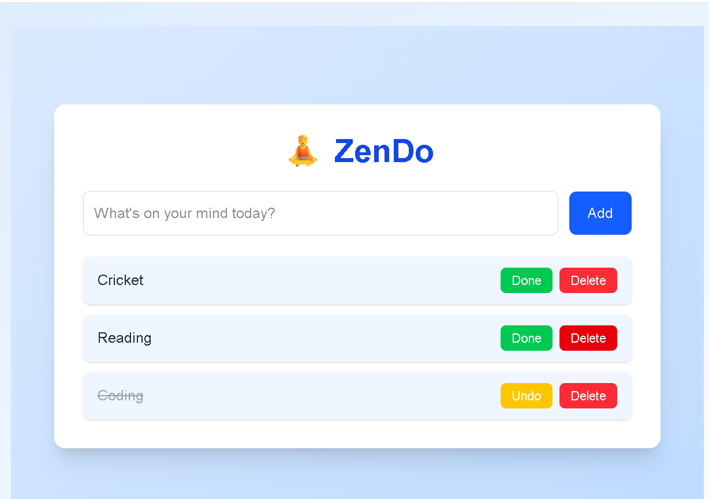

# 🧘 ZenDo - A Minimal To-Do App

ZenDo is a calm, focused task management app built with **Next.js** and **Tailwind CSS**.  
It helps you track your daily tasks with a clean UI and stores them using **localStorage**, so your progress stays safe.

---

## 📸 Screenshots

### 🖥️ Home Page



### ✅ Tasks Added



---

## 🚀 Features

- ✅ Add tasks with a smooth input UI
- ✅ Mark tasks as completed (with line-through)
- ✅ Delete tasks when done
- ✅ Data persists using localStorage
- ✅ Responsive and mobile-friendly layout
- ✅ Styled with Tailwind CSS

---

## 🛠️ Tech Stack

- [Next.js](https://nextjs.org/)
- [React](https://reactjs.org/)
- [Tailwind CSS](https://tailwindcss.com/)

---

## 🧩 How to Run Locally

```bash
# Clone the repo
git clone https://github.com/AgrawalSujal/Zendo---A-Minimal-NextJS-Todo-App.git
cd zendo

# Install dependencies
npm install

# Run the development server
npm run dev
```
